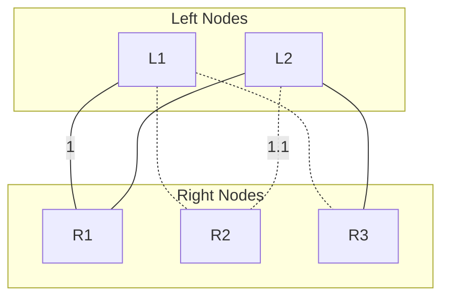

# Exploring Content-Based Recommendation Systems in Bipartite Graphs

This article investigates content-based recommendation systems within bipartite graphs. These systems utilize object similarity to predict unobserved edges, offering the potential for improved recommendation accuracy and an enhanced user experience. We explore the fundamentals of this approach, where object attributes and relationships are leveraged to create tailored suggestions. Central to our investigation is the assumption of similarity between objects, which forms the bedrock for predicting associations. By estimating unobserved connections through observed ones, we highlight the effectiveness of this method and its significance in the landscape of personalization and content consumption. This work sheds light on the mechanisms underpinning content-based recommendation systems and their potential to redefine user interactions with digital content.

## Introduction

In the ever-expanding landscape of information and digital content, the ability to provide personalized recommendations has become integral to enhancing user experiences across various platforms. Content-based recommendation systems represent a pivotal paradigm in this landscape, leveraging the power of attribute-rich objects and bipartite graphs to offer tailored suggestions to users. These systems are particularly valuable in scenarios where only a subset of connections is observed, making it crucial to find hidden associations between different types of objects. This paper delves into the intricacies of content-based recommendation systems, exploring the intricate relationships between objects and the underlying assumptions that drive their effectiveness.

### Graph-Based Recommendation

At the core of our investigation lies a fully-connected bipartite graph, where two distinct types of objects populate the left and right parts of the graph. Each object is characterized by a unique set of attributes, endowing the system with the information needed for recommendation. The edges between these objects are weighted, signifying the degree of association or relevance. However, it is important to note that only a subset of these edges is observed, creating a challenging environment for recommendation algorithms. Given one object on the left, the primary goal is to identify the most suitable counterpart on the right, optimizing a defined objective function.

### Underlying Assumptions

To establish a foundation for this recommendation framework, we operate under a crucial assumption – the similarity of objects. If two objects, L1 and L2, on the left part of the graph share similarity, and likewise, if two objects, R1 and R2, on the right part of the graph exhibit analogous attributes, then the edge weight (L1, R1) will approximate the edge weight (L2, R2). This assumption becomes the keystone to our recommendation process. When an edge (L1, R1) is observed, it paves the way for estimating the edge (L2, R2) by quantifying the resemblance between L1 and L2, as well as R1 and R2.

In the presented graph, solid lines represent observed edges, while dashed lines denote the edges we aim to predict. Notably, the edge weight between L1 and R1 is among the observed data points, and our objective is to predict the edge weight between L2 and R2. This prediction is made possible by harnessing the similarity between L1 and L2, as well as R1 and R2.

Our approach hinges on the assumption that L1 and L2 share significant similarities, as do R1 and R2. With these assumptions in place, we can estimate the edge weight between L2 and R2 by leveraging the observed edge weight between L1 and R1. This predictive process is facilitated by the graph's interconnected structure, allowing us to utilize observed associations to infer unobserved ones.

This paper unfolds the intricate workings of content-based recommendation systems within the context of graph theory, leveraging the idea of object similarity to expand the boundaries of recommendation accuracy. In the following sections, we delve into the algorithms, strategies, and empirical findings that drive these systems, shedding light on the potential they hold for transforming the landscape of user experiences and content consumption.
### Method

#### Neural Network Model

To create a content-based recommendation system, we constructed a neural network model. This model takes advantage of the attributes associated with two types of nodes in a bipartite graph. Specifically, we have two input streams, each dedicated to capturing the attributes of the respective types of nodes in the graph.

##### Input Streams

- **Left Node Attributes**: One input stream is responsible for processing the attributes of nodes on the left side of the bipartite graph.
- **Right Node Attributes**: The other input stream is designed to ingest and process the attributes of nodes on the right side of the graph.

##### Output Layer
The output layer of the neural network is responsible for predicting the edge weight between nodes. It computes a scalar value, representing the strength of association between a given pair of nodes.

##### Loss Function
The training objective of the neural network involves minimizing a chosen loss function that measures the disparity between the predicted edge weight and the observed edge weight. While the mean squared error is a common choice, various other reasonable loss functions can be applied based on the specific characteristics and objectives of the recommendation system.

#### Training

With the neural network architecture in place, the model is trained using a labeled dataset that contains observed edge weights. The training process involves optimizing the model's parameters to minimize the chosen loss function. This ensures that the model learns to estimate the edge weights accurately based on the specified loss criterion.

#### Downstream Task: Edge Weight Maximization

Once the model is trained, it can be leveraged for a downstream task related to recommendation. In this scenario, the goal is to maximize the edge weight between a given node on the left and a node on the right.

##### Input to the Model
For this task, we provide the attributes of the node on the left as input to the trained neural network model.

##### Gradient Ascent
To find the node on the right that maximizes the edge weight, we employ gradient ascent. This optimization technique iteratively adjusts the attributes of the right-side node while monitoring the predicted edge weight, aiming to increase it as much as possible.

This method effectively transforms the trained neural network into a recommendation engine, allowing us to identify the most relevant node on the right that maximizes the association with a given left-side node based on their attributes while accommodating various loss functions as needed.
